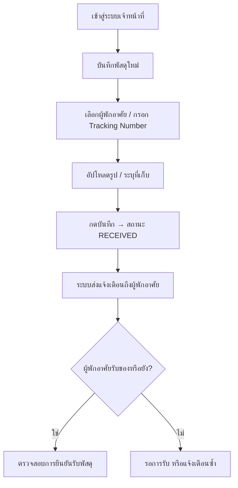
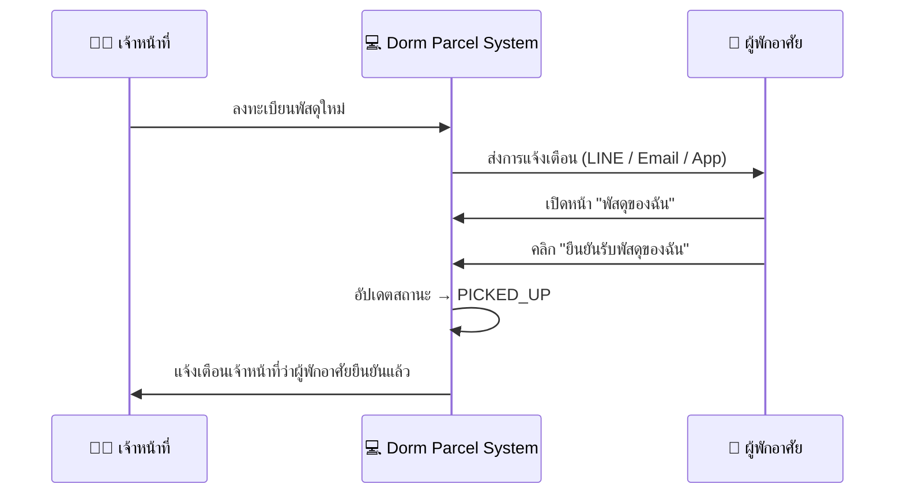
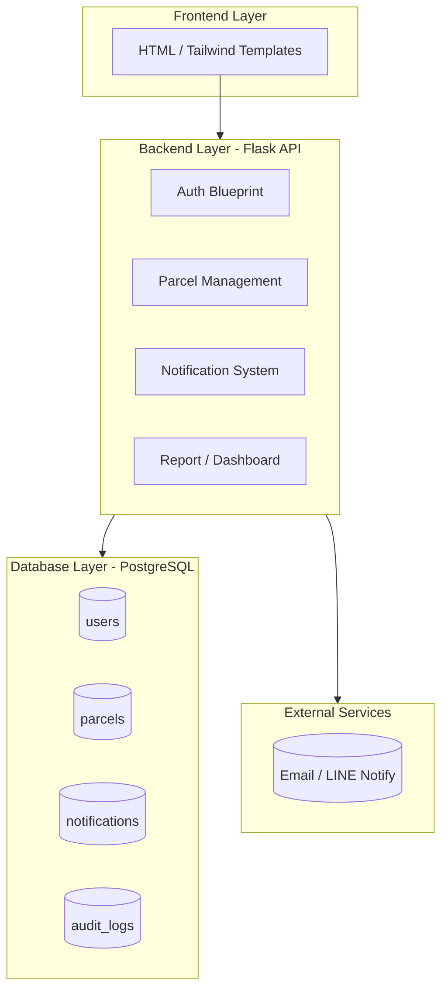

# 📦 Dorm Parcel System  
> **ระบบจัดการพัสดุในหอพัก (Dormitory Parcel Management System)**  
> ใช้สำหรับบันทึก รับ–ส่ง และตรวจสอบพัสดุในหอพักนักศึกษา  
> พัฒนาโดย **Flask + PostgreSQL + Docker Compose**

---

## 🧭 ภาพรวมการทำงานของระบบ (System Overview)

### 🎯 วัตถุประสงค์หลัก  
ระบบนี้ออกแบบมาเพื่อ  
- ลดความผิดพลาดในการจัดเก็บและส่งพัสดุในหอพัก  
- ให้ผู้พักอาศัยสามารถตรวจสอบและยืนยันการรับพัสดุได้ด้วยตนเอง  
- ช่วยให้เจ้าหน้าที่ติดตามพัสดุได้อย่างเป็นระบบ  
- ให้ผู้ดูแลระบบสามารถดูรายงานและตรวจสอบประวัติได้ง่าย  

---

## 🧩 บทบาทผู้ใช้งาน (User Roles)
| บทบาท | คำอธิบาย | สิทธิ์หลัก |
|--------|-----------|-------------|
| **Resident (ผู้พักอาศัย)** | นักศึกษาหรือผู้เช่าหอที่รับพัสดุ | ดูรายการพัสดุ, ยืนยันรับพัสดุ, ตรวจสอบแจ้งเตือน |
| **Officer (เจ้าหน้าที่)** | ผู้ดูแลรับ–ส่งพัสดุในหอพัก | ลงทะเบียนพัสดุใหม่, ตรวจสอบ/ค้นหา, ยืนยันพัสดุแทนผู้รับ |
| **Admin (ผู้ดูแลระบบ)** | ผู้บริหารระบบทั้งหมด | จัดการผู้ใช้, ดูรายงาน, ตรวจสอบประวัติการทำงาน |

---

## 🔄 ภาพรวมการทำงานหลัก (System Workflow)

### 🧮 ขั้นตอนการทำงานโดยรวม
```mermaid
flowchart TD
    A[พัสดุมาถึงหอพัก] --> B[เจ้าหน้าที่บันทึกพัสดุเข้าระบบ]
    B --> C[ระบบส่งการแจ้งเตือนถึงผู้พักอาศัย]
    C --> D[ผู้พักอาศัยเข้าดูรายการพัสดุของตนเอง]
    D --> E{ได้รับพัสดุแล้วหรือไม่?}
    E -- ใช่ --> F[ผู้พักอาศัยกดยืนยัน "รับพัสดุแล้ว"]
    E -- ไม่ --> G[รอรับ / ระบบแจ้งเตือนซ้ำ]
    F --> H[สถานะพัสดุเปลี่ยนเป็น PICKED_UP]
    H --> I[บันทึกลงประวัติการรับพัสดุ]
    I --> J[แสดงในรายงานให้ผู้ดูแลระบบตรวจสอบได้]
```

---

## 📦 การทำงานแยกตามบทบาท

### 👤 ผู้พักอาศัย (Resident)
```mermaid
flowchart LR
    R1[เข้าสู่ระบบ] --> R2[ดูรายการพัสดุของฉัน]
    R2 --> R3{พัสดุพร้อมรับหรือยัง?}
    R3 -- พร้อม --> R4[คลิก "ยืนยันรับพัสดุ"]
    R4 --> R5[ระบบอัปเดตสถานะ → PICKED_UP]
    R5 --> R6[ได้รับการแจ้งเตือนยืนยันสำเร็จ]
    R3 -- ยังไม่พร้อม --> R7[รอการแจ้งเตือนถัดไป]
```

---

### 🧑‍💼 เจ้าหน้าที่ (Officer)


---

### 🛠️ ผู้ดูแลระบบ (Admin)
```mermaid
flowchart LR
    A1[เข้าสู่ระบบผู้ดูแล] --> A2[จัดการผู้ใช้ / บทบาท]
    A2 --> A3[ดูรายงานพัสดุรายวัน/รายเดือน]
    A3 --> A4[ตรวจสอบประวัติการเปลี่ยนสถานะ (Audit Logs)]
    A4 --> A5[ดูข้อมูลเชิงสถิติ เช่น พัสดุค้างรับ]
```

---

## 🔔 ระบบแจ้งเตือน (Notification Flow)


---

## 🧠 ฟังก์ชันหลักของระบบ (Core Features)
| หมวด | รายละเอียด |
|-------|-------------|
| **Authentication** | Login / Signup / Logout ตามบทบาท |
| **User Management** | จัดการผู้ใช้และสิทธิ์การเข้าถึง |
| **Parcel Management** | เพิ่ม, ลบ, อัปเดต, ค้นหา และเปลี่ยนสถานะพัสดุ |
| **Resident Self-Confirmation** | ผู้พักอาศัยกดยืนยันรับพัสดุเองผ่านเว็บ |
| **Notification System** | แจ้งเตือนเมื่อมีพัสดุใหม่ หรือพัสดุพร้อมรับ |
| **Reporting** | สรุปจำนวนพัสดุ รายวัน / เดือน |
| **Audit Logging** | เก็บประวัติทุกการเปลี่ยนแปลงของพัสดุ |
| **Scheduler Reminder** | แจ้งเตือนซ้ำสำหรับพัสดุที่ค้างรับนานเกินกำหนด |

---

## 🧱 โครงสร้างระบบ (Architecture Overview)


---

## 📘 ภาพรวมแต่ละขั้นตอน (Summary Flow)
| ลำดับ | ขั้นตอน | ผู้เกี่ยวข้อง | คำอธิบาย |
|--------|-----------|----------------|-------------|
| 1 | รับพัสดุที่หอพัก | เจ้าหน้าที่ | ลงทะเบียนพัสดุเข้าสู่ระบบ |
| 2 | แจ้งเตือนผู้พักอาศัย | ระบบ | ส่งข้อความผ่านช่องทางที่ตั้งไว้ |
| 3 | ผู้พักอาศัยตรวจสอบ | Resident | ดูพัสดุของตัวเองในระบบ |
| 4 | ผู้พักอาศัยกดยืนยันรับ | Resident | ยืนยันว่ารับของแล้ว |
| 5 | ระบบอัปเดตสถานะ | System | เปลี่ยนเป็น PICKED_UP |
| 6 | บันทึกประวัติและรายงาน | System & Admin | เก็บลง Audit / รายงานสรุป |

---

## 📄 หมายเหตุ
- ระบบรองรับการ Login หลายบทบาทในหน้าเดียวกัน  
- การยืนยันรับพัสดุสามารถทำได้ทั้งฝั่ง **Resident** และ **Officer**  
- รองรับการขยายในอนาคต เช่น **QR Code Scan**, **LINE Notify**, **สถิติรายอาคาร**

---

## 🧾 ส่วน ER Diagram `
